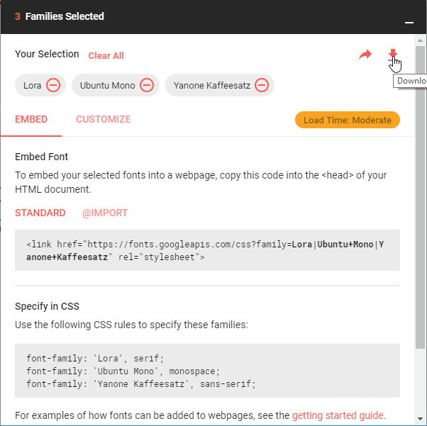

I'm a big fan of markdown, this let's you focus on the content, not the style. Markdown (and other similar systems) are commonly used for blogs and documentation. What about slides? Let's try a solution that looks pretty nice: [remark](https://remarkjs.com).

<!--more-->

# 2 remarks

There are 2 "remark" things:

- https://github.com/remarkjs/remark : looks like a general purpose api to generate html from markdown, but is unrelated to the remark we want to use here
- **https://github.com/gnab/remark : this is the one we are interested in**

# remark resources

There are 3 resources about **remark**:

- https://remarkjs.com is the demo/introduction slideshow, you should start here
- https://github.com/gnab/remark/wiki is the documentation
- https://github.com/gnab/remark is the github repo, note you don't really need to clone it to use remark
- note there is no npm package for remark, because remark javascript code lives in the browser

# remark html structure

remark presentations are html files with a simple structure. So when you find a remark-generated presentation that looks good, it's quite easy to read the html source and extract the bits you like for your own usage.

Let's take advantage of this, we'll take https://remarkjs.com/#1 and make a tweakable **and 100% offline** version of it.

- visit https://remarkjs.com/#1
- view the source html, it has 3 main sections:
  - at the beginning `<style>...</style>` contains the css
  - in the middle `<textarea id="source">...</textarea>` contains the markdown
  - at the end, the multiple `<script>...</script>` contain the javascript

remark html structure:


<html>

<head>
  <meta charset="utf-8" />
  <title>my_title</title>
  <style>
    my_css{}
  </style>
</head>

<body>
  <textarea id="source">
    my_markdown
  </textarea>
  <script>my_javascript</script>
  <script>my_other_javascript</script>
</body>

</html>


Let's split this source html into a few files:
```
+ common
  + remark.language.js
  + remark-latest.min.js
  + style.css
+ remark-playground
  + slides.md
  + slides.html
```

- `common/remark.language.js`
  - a local copy of https://remarkjs.com/remark.language.js
- `common/remark-latest.min.js`
  - a local copy of https://remarkjs.com/downloads/remark-latest.min.js
- `common/style.css`
  - in which we copy the text between `<style>...</style>` from the https://remarkjs.com/#1 source
- `remark-playground/demo.md`
  - in which we copy the text between `<textarea id="source">...</textarea>` from the https://remarkjs.com/#1 source
- `remark-playground/slides.html`
  - with this content:


<!DOCTYPE html>
<html>

<head>
  <meta charset="utf-8" />
  <meta name="keywords" content="remark,remarkjs,markdown,slideshow,presentation" />
  <meta name="description" content="My demo/test of remark, making sure we this works offline as weel" />
  <title>my-remark-demo</title>
  <style>
    @import url("common/style.css"); /* moved the css to a separate common/style.css file */
  </style>
</head>

<body>
  <textarea id="source">
    <!-- moved the markdown to a separate demo.md file -->
  </textarea>
  <script src="common/remark-latest.min.js"></script> <!-- modified to point to our local copy -->
  <script>
    var hljs = remark.highlighter.engine;
  </script>
  <script src="common/remark.language.js"></script> <!-- modified to point to our local copy -->
  <script>
    var slideshow = remark.create({
      sourceUrl: 'demo.md', // reference the separate demo.md file
      highlightStyle: 'monokai',
      highlightLanguage: 'remark',
      highlightLines: true
    });
  </script>
  <!-- removed the google analytics script -->
</body>

</html>


Now the only external resources the presentation depends on are the fonts:


@import url(https://fonts.googleapis.com/css?family=Droid+Serif);
@import url(https://fonts.googleapis.com/css?family=Yanone+Kaffeesatz);
@import url(https://fonts.googleapis.com/css?family=Ubuntu+Mono:400,700,400italic);


You can visit https://fonts.google.com/ to download the fonts...
Except that the **Droid Serif** font cannot be downloaded for free, so we'll use "Lora" instead that looks similar enough.
Here is a [link](https://fonts.google.com/?selection.family=Lora|Ubuntu+Mono|Yanone+Kaffeesatz) with the 3 fonts preselected:



You download a `font.zip` file, extract it in your `common` directory, then in `common/style.css`, replace:


@import url(https://fonts.googleapis.com/css?family=Droid+Serif);
@import url(https://fonts.googleapis.com/css?family=Yanone+Kaffeesatz);
@import url(https://fonts.googleapis.com/css?family=Ubuntu+Mono:400,700,400italic);

body {
  font-family: 'Droid Serif';
}


with


/* Lora used for body */
@font-face{
  font-family: 'Lora';
  src: url('Lora/Lora-Regular.ttf');
}
@font-face{
  font-family: 'Lora';
  src: url('Lora/Lora-Bold.ttf');
  font-weight: bold;
}
@font-face{
  font-family: 'Lora';
  src: url('Lora/Lora-Italic.ttf');
  font-style: italic;
}
@font-face{
  font-family: 'Lora';
  src: url('Lora/Lora-BoldItalic.ttf');
  font-weight: bold;
  font-style: italic;
}

/* Yanone Kaffeesatz used for h1, h2, h3 */
@font-face{
  font-family: 'Yanone Kaffeesatz';
  src: url('Yanone_Kaffeesatz/YanoneKaffeesatz-Regular.ttf');
}
@font-face{
  font-family: 'Yanone_Kaffeesatz';
  src: url('Yanone_Kaffeesatz/YanoneKaffeesatz-Bold.ttf');
  font-weight: bold;
}

/* Ubuntu Mono used for code, do we need Italic for code ? */
@font-face{
  font-family: 'Ubuntu Mono';
  src: url('Ubuntu_Mono/UbuntuMono-Regular.ttf');
}
@font-face{
  font-family: 'Ubuntu Mono';
  src: url('Ubuntu_Mono/UbuntuMono-Bold.ttf');
  font-weight: bold;
}
@font-face{
  font-family: 'Ubuntu Mono';
  src: url('Ubuntu_Mono/UbuntuMono-Italic.ttf');
  font-style: italic;
}
@font-face{
  font-family: 'Ubuntu Mono';
  src: url('Ubuntu_Mono/UbuntuMono-BoldItalic.ttf');
  font-weight: bold;
  font-style: italic;
}


body {
  font-family: 'Lora';
}


Even if all resources are local, to run the presentation, you need to start an http server. To run the presentation, on windows, create a **run.bat** file:


start py -3 -m http.server
start http://localhost:8000/slides.html


[The resulting presentation](/slides-remark/remark-playground/slides.html)


# Embed everything in one html ?

I tried https://github.com/BitLooter/htmlark which looks promising but I could not find a way to make it work in the remark case.

# Print to PDF

Print to PDF is important to export your slides in one big file (given that one big html is not possible). But you'd better have Chrome:
- Chrome: works well
- Firefox: only prints the first slide 
- Edge: prints slides with a nasty offset

