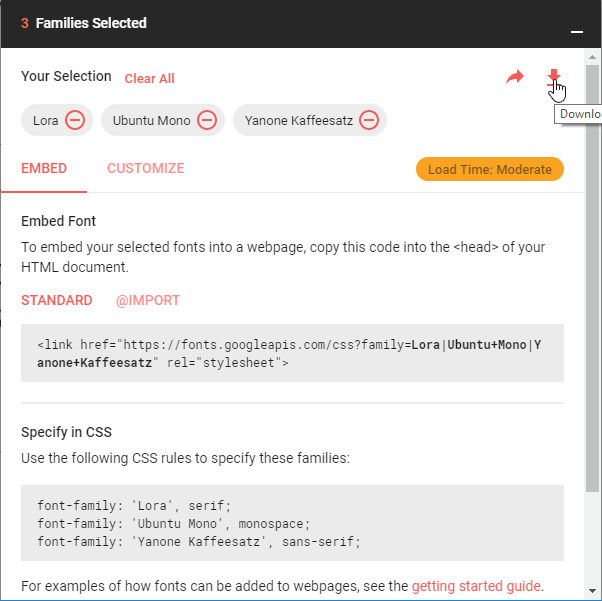

I'm a big fan of Markdown, it lets you focus on the content, not the style. Markdown (and other similar systems) is commonly used for blogs and documentation. What about slides? Let's try [remark](https://remarkjs.com), and see how we can create slides that work both **online** and **offline**.

<!--more-->

# 2 remarks

There are 2 "remark" things:

- https://github.com/remarkjs/remark : looks like a general purpose api to generate html from markdown, but is unrelated to the remark we want to use here
- **https://github.com/gnab/remark : this is the one we are interested in**

# remark resources

There are 3 important sources of information about **remark**:

- https://remarkjs.com is the demo/introduction slideshow, you should start here
- https://github.com/gnab/remark/wiki is the documentation
- https://github.com/gnab/remark is the github repo, note you don't need to clone it to use remark

# remark html structure

remark presentations are html files with a simple structure. So when you find a remark-generated presentation that looks good, it's quite easy to read the html source and extract the bits you like for your own usage.

Let's take advantage of this, we'll take https://remarkjs.com/#1 and make a tweakable, **offline**, **http server free**, version of it.

- visit https://remarkjs.com/#1
- view the source html, it has 3 main sections:
  - at the beginning `<style>...</style>` contains the css
  - in the middle `<textarea id="source">...</textarea>` contains the markdown
  - at the end, the multiple `<script>...</script>` contain the javascript

*The remark html structure:*

```html
<html>

<head>
  <meta charset="utf-8" />
  <title>my_title</title>
  <style>
    my_css{}
  </style>
</head>

<body>
  <textarea id="source">
    ...
    the markdown
    ...
  </textarea>
  <script>my_javascript</script>
  <script>my_other_javascript</script>
</body>

</html>
```

Let's split this source html into a few files:
```
+ common
  + remark.language.js
  + remark-latest.min.js
  + style.css
  + fonts.css
+ remark-playground.html
```

- `common/remark.language.js`
  - a local copy of https://remarkjs.com/remark.language.js
- `common/remark-latest.min.js`
  - a local copy of https://remarkjs.com/downloads/remark-latest.min.js
- `common/style.css`
  - in which we copy the text between `<style>...</style>` from the https://remarkjs.com/#1 source
- `common/fonts.css`
  - content a bit below
- `remark-playground.html`
  - content a bit below

We respected 2 important constraints here:

- We kept the markdown inside the html, as opposed to put it a separatd .md file
- The `common` directory is a sub directory of `remark-playground.html` containing directory

Those 2 constraints allow to open the presentation by simply double-clicking on the html. 

If you don't respect the constraint, you need to run a local http server. It's a 2-liners, but still very annoying for people who receive the presentation in a zip by mail.

*The local http server 2-liners for info:*
```cmd
start py -3 -m http.server
start http://localhost:8000/remark-playground.html
```

*The remark-playground.html content*:

```html
<!DOCTYPE html>
<html>

<head>
  <meta charset="utf-8" />
  <meta name="keywords" content="remark,remarkjs,markdown,slideshow,presentation,Guillaume Aldebert" />
  <meta name="description" content="My playground of remark, making sure it works offline as well" />
  <title>remark-playground</title>
  <style>
    /* modified to point to our local separate files */
    @import url("common/fonts.css");
    @import url("common/style.css"); 
  </style>
</head>

<body>
  <textarea id="source">
    ...
    the markdown
    ...
  </textarea>
  <!-- modified to point to our local copy -->
  <script src="common/remark-latest.min.js"></script>
  <script>
    var hljs = remark.highlighter.engine;
  </script>
  <!-- modified to point to our local copy -->
  <script src="common/remark.language.js"></script>
  <script>
    var slideshow = remark.create({
      highlightStyle: 'monokai',
      highlightLanguage: 'remark',
      highlightLines: true
    });
  </script>
  <!-- removed the google analytics script -->
</body>

</html>
```

Now, the only online dependencies of the presentation are the fonts:

```css
@import url(https://fonts.googleapis.com/css?family=Droid+Serif);
@import url(https://fonts.googleapis.com/css?family=Yanone+Kaffeesatz);
@import url(https://fonts.googleapis.com/css?family=Ubuntu+Mono:400,700,400italic);
```

You can visit https://fonts.google.com/ to download the fonts...
Except that the **Droid Serif** font cannot be downloaded for free, so we'll use "Lora" instead that looks similar enough.
Here is a [link](https://fonts.google.com/?selection.family=Lora|Ubuntu+Mono|Yanone+Kaffeesatz) with the 3 fonts preselected that will lead you to:



You download a `font.zip` file, extract it in your `common` directory, then in `common/style.css`, replace:

```css
@import url(https://fonts.googleapis.com/css?family=Droid+Serif);
@import url(https://fonts.googleapis.com/css?family=Yanone+Kaffeesatz);
@import url(https://fonts.googleapis.com/css?family=Ubuntu+Mono:400,700,400italic);

body {
  font-family: 'Droid Serif';
}
```

with

```css
body {
  font-family: 'Lora';
}
```

and create a new separate file `common/fonts.css`:

```css
/* Lora used for body */
@font-face{
  font-family: 'Lora';
  src: url('Lora/Lora-Regular.ttf');
}
@font-face{
  font-family: 'Lora';
  src: url('Lora/Lora-Bold.ttf');
  font-weight: bold;
}
@font-face{
  font-family: 'Lora';
  src: url('Lora/Lora-Italic.ttf');
  font-style: italic;
}
@font-face{
  font-family: 'Lora';
  src: url('Lora/Lora-BoldItalic.ttf');
  font-weight: bold;
  font-style: italic;
}

/* Yanone Kaffeesatz used for h1, h2, h3 */
@font-face{
  font-family: 'Yanone Kaffeesatz';
  src: url('Yanone_Kaffeesatz/YanoneKaffeesatz-Regular.ttf');
}
@font-face{
  font-family: 'Yanone_Kaffeesatz';
  src: url('Yanone_Kaffeesatz/YanoneKaffeesatz-Bold.ttf');
  font-weight: bold;
}

/* Ubuntu Mono used for code, do we need Italic for code ? */
@font-face{
  font-family: 'Ubuntu Mono';
  src: url('Ubuntu_Mono/UbuntuMono-Regular.ttf');
}
@font-face{
  font-family: 'Ubuntu Mono';
  src: url('Ubuntu_Mono/UbuntuMono-Bold.ttf');
  font-weight: bold;
}
@font-face{
  font-family: 'Ubuntu Mono';
  src: url('Ubuntu_Mono/UbuntuMono-Italic.ttf');
  font-style: italic;
}
@font-face{
  font-family: 'Ubuntu Mono';
  src: url('Ubuntu_Mono/UbuntuMono-BoldItalic.ttf');
  font-weight: bold;
  font-style: italic;
}
```


# The resulting slides

You can:

- open slides locally, just open `file:///your/local/path/remark-playground.html` in your browser
- open slides online in their [own page](/remark-playground.html)
- embed the online slides in another page like this:

<div class="aspect_ratio_4_3">
  <div>
    <embed src="/remark-playground.html" style="width: 100%; height: 100%;">
  </div>
</div>

If you want to run the slides locally and offline, get the content of https://github.com/galdebert/blog/tree/master/slides.


# Conclusion

Here we go, you have a remark html file that:

- can be opened locally in your browser
- can be hosted online

Now you can start [looking into](https://github.com/gnab/remark/wiki) how to layout your slides using the remark markdown-like syntax.
